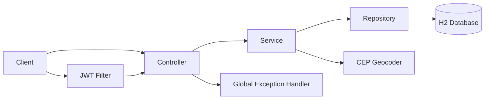

# Architecture

## Workspace Layout

```text
server/   Spring Boot API
client/   Future frontend application
docs/     Project documentation
```

## Backend Layers



- **Controllers** own HTTP mapping, request validation, and response status selection.
- **Services** own business rules and transaction boundaries.
- **Repositories** are Spring Data JPA persistence adapters.
- **Mappers** translate entities to/from public request and response DTOs.
- **GlobalExceptionHandler** converts application failures into the shared `ApiError` contract.

## Integrations

- H2 is the local database. Hibernate creates and drops the schema for each application lifecycle.
- `BrasilApiCepLocationService` calls the URL configured by `CEP_GEOCODER_BASE_URL` to turn a CEP into coordinates. Its interface permits replacing it with another geocoder without changing restaurant logic.
- JWTs are signed with `JWT_SECRET`; passwords are BCrypt hashes. Spring Security applies stateless authentication to canonical `/api` routes.
- Springdoc provides `/v3/api-docs` and `/swagger-ui.html`. JaCoCo publishes coverage in `server/target/site/jacoco` after `verify`.

## API Versioning and Compatibility

`/api` is the canonical API base path. Unprefixed mappings remain for compatibility and should be considered deprecated integration paths. New consumers should use only `/api` paths.
