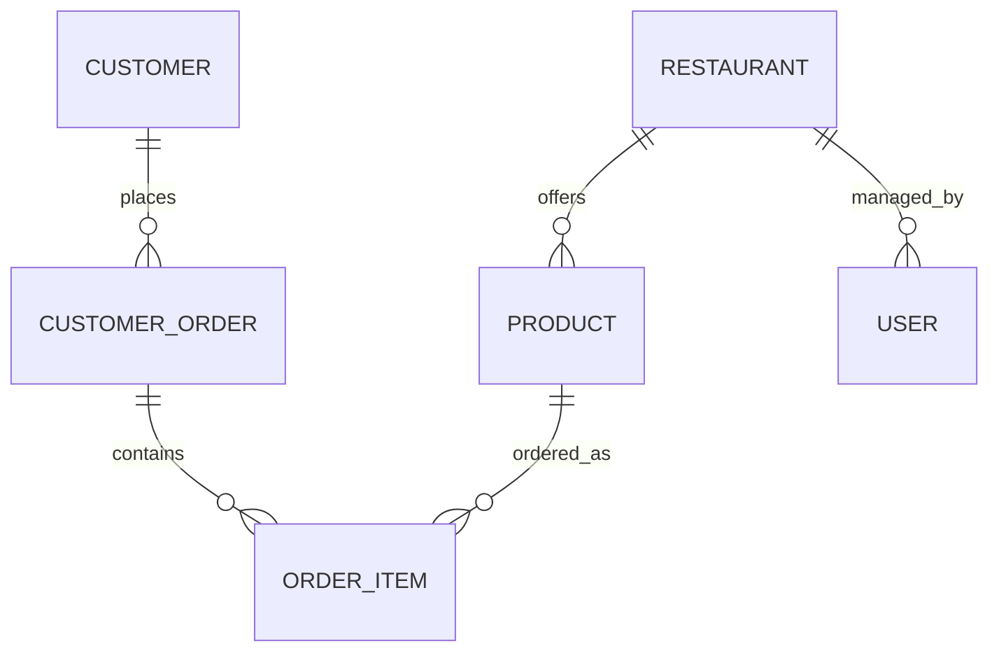

# Domain Model

## Entities

- **Customer**: name, email, phone, address, active state, and order history. Email is unique.
- **Restaurant**: catalog owner with category, contact fields, active state, rating, delivery fee, CEP, delivery time, and coordinates.
- **Product**: restaurant offering with name, category, description, price, availability, and stock.
- **CustomerOrder**: customer order header with order date, delivery address, status, total, optimistic-lock version, and items.
- **OrderItem**: product, positive quantity, and captured line subtotal.
- **User**: authentication account with email, BCrypt password hash, role, active state, creation time, and optional restaurant association.

## Business Rules

- Only active customers may place orders.
- Every order must have a delivery address and at least one item.
- Products in an order must be available and belong to one active restaurant.
- Requested quantities must be in stock. Stock is decremented as part of the order transaction.
- An order total is its item subtotals plus the restaurant delivery fee.
- Restaurant delivery time must be between 10 and 120 minutes. Product price must be greater than zero and no more than R$500.
- A `RESTAURANT` user must reference an existing restaurant during registration.

## Order Lifecycle

`PENDING` can become `CONFIRMED` or `CANCELLED`; `CONFIRMED` can become `PREPARING` or `CANCELLED`; `PREPARING` can become `SHIPPED` or `CANCELLED`; and `SHIPPED` can become `DELIVERED`. `DELIVERED` and `CANCELLED` are terminal states.
