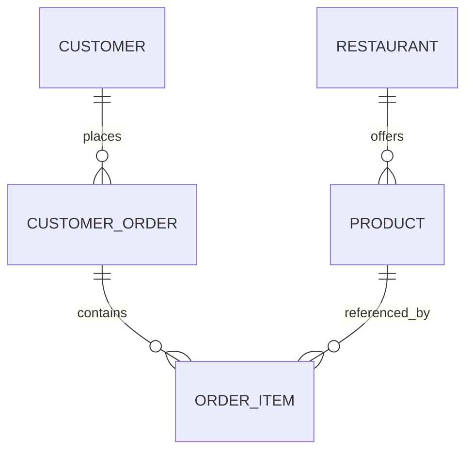

# Current State

This document describes the application as it exists today, not the intended end state.

## Overview

The project is a Spring Boot delivery API backed by an in-memory H2 database. It currently contains the core domain model, service layer logic, sample data loading, and one implemented REST surface for customers.

## Domain Model

### Core Entities

- `Customer`: customer profile, contact data, and active flag.
- `Restaurant`: restaurant profile, category, rating, delivery fee, and active flag.
- `Product`: catalog item associated with a restaurant.
- `CustomerOrder`: order header with status, total amount, and order date.
- `OrderItem`: line item that connects an order to a product.

## Business Rules

- Customer email must be unique.
- Customers must be active to create or manage orders.
- Product price must be greater than zero.
- Restaurant rating must be between 0 and 5.
- Order status transitions are guarded by `CustomerOrderStatus`.

## Data Loading

`DataLoader` inserts sample data at startup so the application has realistic records immediately after boot.

Seeded data includes:

- 3 customers
- 2 restaurants
- 5 products
- 2 orders with order items

## API Surface

### Implemented

- `POST /customers`
- `GET /customers`
- `GET /customers/{id}`
- `PUT /customers/{id}`
- `DELETE /customers/{id}`

### Scaffolded Only

- `/restaurants`
- `/products`
- `/customers-orders`

Those controllers currently return placeholder responses and should not be treated as complete API contracts.

## Runtime Configuration

- Application port: `8080`
- Database: H2 in-memory at `jdbc:h2:mem:deliverydb`
- Schema mode: `create-drop`
- SQL logging: enabled
- H2 console: `/h2-console`

## Repository Layer

The repositories already expose query methods for active customers, products by restaurant, restaurant rankings, and customer order searches by date, status, and customer.

## Known Gaps

- The domain is richer than the HTTP layer, but most endpoints are not wired yet.
- There are no DTOs or API response contracts yet.
- Error handling is still basic and inconsistent across controllers.
- The only automated test in the repository is the Spring Boot context test.
